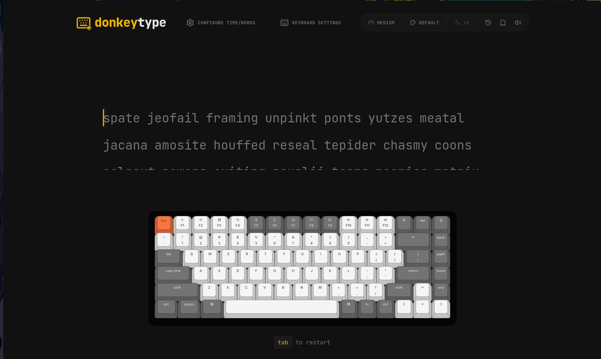

# DonkeyType

A customizable typing test application built with React, Zustand, and TailwindCSS.



## Features

- **End-to-End Typing Flow**: Clean, distraction-free UI that fades out non-essential elements when you start typing.
- **Dynamic Color Themes**: Instantly switch between 5 palettes (Default, Nord, Matcha, Cyberpunk, Midnight).
- **Ghost Mode (Race yourself)**: Toggle Ghost mode to visually race against a blue caret representing your previous best WPM for that exact text.
- **Multilingual Support**: Supports both standard English and Devanagari Hindi typing with correct complex-grapheme ligature rendering.
- **Multiple Difficulties**: Choose between Easy, Medium, and Hard word pools.
- **Synthetic Audio Engine**: Low latency mechanical keyboard sounds synthesized via the Web Audio API.
- **Persistent Stats**: Saves your run history to `localStorage`.
- **Interactive History Dashboard**: View WPM and Accuracy progression via a Recharts line graph.

## Quick Start

Ensure you have [Node.js](https://nodejs.org/) and [pnpm](https://pnpm.io/) installed.

```bash
git clone https://github.com/yourusername/donkey-type.git
cd donkey-type
pnpm install
pnpm run dev
```

The app will be available at `http://localhost:5173`.

## Tech Stack

- **Framework**: [React 19](https://react.dev/) with [Vite](https://vitejs.dev/)
- **State Management**: [Zustand](https://github.com/pmndrs/zustand)
- **Styling**: [TailwindCSS v4](https://tailwindcss.com/)
- **Icons**: [Lucide React](https://lucide.dev/)
- **Charts**: [Recharts](https://recharts.org/)

## Shortcuts

- `Tab` - Restart the current test and generate new words.
- `Click anywhere` - Refocuses the typing area if you click away.

## Contributing

Contributions, issues, and feature requests are welcome. Feel free to check the [issues page](https://github.com/yourusername/donkey-type/issues).

## License

This project is licensed under the [MIT License](LICENSE).
